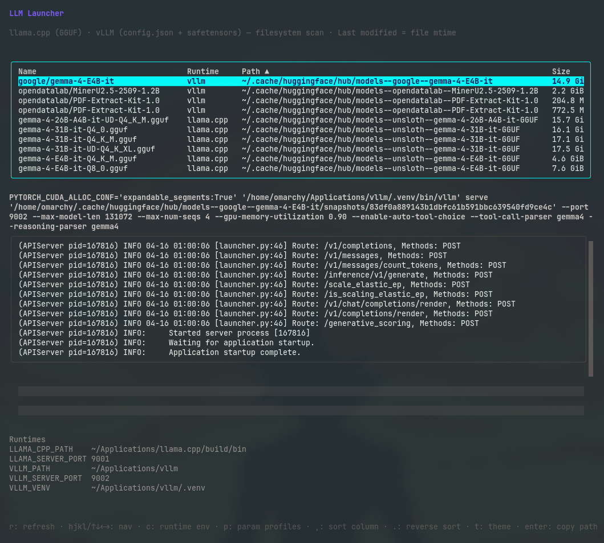

# LLM Launcher (`llml`)

[](go.mod)
[](LICENSE)



**LLM Launcher** (`llml`) is a TUI for people who already have models on disk and are
tired of reconstructing launch commands from shell history.

It scans your local filesystem for **GGUF** and **Hugging Face-style safetensors** models,
detects installed runtimes (**[llama.cpp](https://github.com/ggerganov/llama.cpp)** and
**[vLLM](https://github.com/vllm-project/vllm)**), and lets you save named parameter profiles
per model — so the command that worked last time is always one keystroke away.

Browse local models. Detect the right runtime. Launch with one key.

## ✨ Features

- **Model discovery** — auto-scans common paths for GGUF files and safetensors model
  directories; add extra roots via `LLML_MODEL_PATHS` and/or `config.toml`. Results are
  cached under **`{UserConfigDir}/llml/config.toml`** so the next launch can skip the
  filesystem walk when the cache is still valid.
- **Runtime detection** — finds installed `llama-server` and `vllm` binaries and maps
  each model to its compatible runtime.
- **Named parameter profiles** — save multiple profiles per model (e.g. `fast-laptop`,
  `quality`, `api-8080`), each storing runtime args, env vars, port, and context
  settings. The active profile is always one key away.
- **One-keystroke launch** — select a model, select a profile, press `R`. The generated
  command is shown before execution and server output streams directly in the TUI.
- **Zero required setup** — common model directories and binary locations are checked
  automatically; configure only what differs from the defaults.

## 🚀 Quick start

### Runtime Requirements

- **Runtime engine (at least one)**: **llama.cpp** (`llama-server`) for GGUF models, and/or **vLLM** (`vllm`) for safetensors models are installed (see [Runtime configuration and detection](#runtime-configuration-and-detection)).
- **Models** in default scan locations, or configure custom roots with `LLML_MODEL_PATHS` (see [Model configuration and discovery](#model-configuration-and-discovery)).

### Install

Pick one path; you only need a single install method.

#### Go (`go install`)

Requires [Go 1.26+](go.mod). Ensure `$(go env GOPATH)/bin` is on your `PATH`.

```bash
go install github.com/flyingnobita/llml/cmd/llml@latest
```

#### Homebrew

```bash
brew tap flyingnobita/llml https://github.com/flyingnobita/llml.git
brew install llml
```

Upgrade later with `brew upgrade llml`.

#### Pre-built binaries

For each [GitHub release](https://github.com/flyingnobita/llml/releases), archives are published for Linux and macOS (`tar.gz`) plus Windows (`zip`). Names follow GoReleaser’s pattern, for example `llml_1.2.3_Linux_x86_64.tar.gz`, `llml_1.2.3_Darwin_arm64.tar.gz`, or `llml_1.2.3_Windows_x86_64.zip` (adjust version and OS/arch to match your download). Extract the `llml` binary.

```bash
# Example: Linux x86_64 — use the archive name from the release you downloaded
tar -xzf llml_1.2.3_Linux_x86_64.tar.gz
chmod +x llml
```

Install on your `PATH` if you like (Linux/macOS/WSL):

```bash
sudo mv llml /usr/local/bin/llml
```

No-sudo option:

```bash
mkdir -p "$HOME/.local/bin"
mv llml "$HOME/.local/bin/llml"
```

(Ensure `~/.local/bin` is on your `PATH`.)

Verify the download against `llml_<version>_checksums.txt` on the release page if you rely on checksums (for example `llml_1.2.3_checksums.txt`).

### Build from source

#### Build Requirements

- **Go** [1.26+](go.mod)

```bash
git clone https://github.com/flyingnobita/llml.git
cd llml
go build -o llml ./cmd/llml
```

To install a development build from your clone, use `go install ./cmd/llml` from the repo root, or copy the `llml` binary onto your `PATH`.

### Start

```bash
llml
# or, if running from the current directory:
./llml
```

Place models under default scan locations (see [Model configuration and discovery](#model-configuration-and-discovery)) or set `LLML_MODEL_PATHS`. Point `LLAMA_CPP_PATH` / `VLLM_PATH` at your install dirs if binaries are not on `PATH`. Select a model in the UI and press `R` to launch.

## ⌨️ Usage

| Key         | Action                                                                             |
| ----------- | ---------------------------------------------------------------------------------- |
| `hjkl/↑↓←→` | Move selection; horizontal scroll when the path column is wider than the terminal  |
| `r`         | Reload **`[runtime]`** from `config.toml` and re-detect binaries (no model rescan) |
| `S`         | Full model filesystem rescan; refresh cached **`[[models]]`** in `config.toml`     |
| `R`         | Run server (split view: table + log pane)                                          |
| `ctrl`+`R`  | Run server full-screen                                                             |
| `c`         | Edit runtime environment (paths, ports)                                            |
| `p`         | Edit parameter profiles for the selected model                                     |
| `m`         | Edit extra model search paths (saved in `config.toml`)                             |
| `,` / `.`   | Change sort column / reverse sort direction                                        |
| `enter`     | Copy the launch command for the selected row to the clipboard                      |
| `t`         | Cycle theme (`dark` → `light` → `auto` → …)                                        |
| `?`         | Toggle the full shortcut help overlay                                              |
| `q`         | Quit                                                                               |

### Server output

**`R`** runs the server in a **split layout**: the model table stays in the upper half and server logs stream into a scrollable pane below. **tab** switches focus between the two panes; **esc**, **q**, or **ctrl+c** stops the server.

**ctrl+`R`** runs full-screen: the TUI is suspended and the server process is attached directly to your terminal. On Linux/macOS, after the server exits you are prompted to press Enter before the TUI redraws. On Windows there is no Enter prompt; you return when the server process exits.

### Parameter profiles (`p`)

Each model path can have **multiple named profiles**. Each profile stores:

- **Environment variables** (`KEY=value` per line).
- **Extra arguments** appended after `--port` (for vLLM, flags and values are separate argv tokens; the UI may show `--flag value` on one line).

**`R`** / **ctrl+`R`** use the **active** profile (the highlighted row in the `p` profile list is prefixed with **`(active)`** in the name column). Changes persist automatically. **tab** cycles: profile list → env → extra args. On the profile list: **`a`** add profile, **`c`** clone (duplicate) the highlighted profile, **`d`** delete (not the last), **`r`** rename. **`esc`** closes the panel (and **`n`** cancels a delete confirmation).

Storage is a single JSON file:

| Platform    | Typical path                                                                    |
| ----------- | ------------------------------------------------------------------------------- |
| Linux (XDG) | `$XDG_CONFIG_HOME/llml/model-params.json` or `~/.config/llml/model-params.json` |
| macOS       | `~/Library/Application Support/llml/model-params.json`                          |
| Windows     | `%AppData%\llml\model-params.json`                                              |

## ⚙️ Configuration

Behavior is driven by **environment variables**, optional **`config.toml`**, and the **parameter profiles** JSON file. **Precedence:** env vars override `config.toml`; unset env vars use TOML values, then defaults.

### Config file (`config.toml`)

| Platform    | Typical path                                                        |
| ----------- | ------------------------------------------------------------------- |
| Linux (XDG) | `$XDG_CONFIG_HOME/llml/config.toml` or `~/.config/llml/config.toml` |
| macOS       | `~/Library/Application Support/llml/config.toml`                    |
| Windows     | `%AppData%\llml\config.toml`                                        |

#### Updates vs your data

Installing or upgrading `llml` (Homebrew, Scoop, `go install`, or dropping a release binary on your `PATH`) **replaces only the executable**. Your data lives under **`{UserConfigDir}/llml/`** (see the tables above), not next to the binary, so routine upgrades do not delete `config.toml` or `model-params.json`.

Before overwriting those files, the app saves a timestamped copy under **`{UserConfigDir}/llml/backups/`** and keeps the newest **10** backups per file. When the built-in version string changes between runs (see `llml -version`), it also snapshots both files once at startup so you have a clear upgrade-boundary copy. The file **`.last-run-version`** in the same directory records the last run version for that behavior.

The file stores **`schema_version`**, **`[runtime]`** (stores `default_` paths and ports used when environment variables are unset), **`[discovery]`** (`extra_model_paths`, `last_scan` timestamp), and **`[[models]]`** (cached rows from the last full scan). Parameter profiles remain in **`model-params.json`** only.

On startup, if the cache is valid, the app skips walking the disk; use **`S`** for a full rescan. **`r`** reloads runtime settings from TOML without rescanning models. Saving the **`c`** runtime panel updates the environment and writes **`[runtime]`** (write failures are ignored).

### Runtime configuration and detection

#### Runtime environment variables

| Variable            | Default   | Role                                                                        |
| ------------------- | --------- | --------------------------------------------------------------------------- |
| `LLAMA_CPP_PATH`    | _(unset)_ | Directory containing `llama-cli` / `llama-server` (checked before `PATH`)   |
| `VLLM_PATH`         | _(unset)_ | Directory where `vllm` or `.venv/bin/vllm` may live                         |
| `VLLM_VENV`         | _(unset)_ | Python venv root; on Unix, **`R`** may `source bin/activate` before `vllm`  |
| `LLAMA_SERVER_PORT` | `8080`    | Port for `llama-server` and `/health` probe                                 |
| `VLLM_SERVER_PORT`  | `8000`    | Port for `vllm serve`                                                       |
| `LLML_THEME`        | `auto`    | Initial TUI palette; **`t`** cycles `dark` → `light` → `auto` while running |

Set these in your shell, or under `[env]` in `mise.local.toml` (gitignored) for local development with mise.

#### Runtime detection order

On launch (and after **`r`**), the app resolves **llama.cpp** and **vLLM** binaries. Model discovery runs on first start, after **`S`**, or when the cache is missing or stale; **`r`** does not rescan models.

**llama.cpp (`llama-cli` / `llama-server`)**

1. **`LLAMA_CPP_PATH`** if set: `{LLAMA_CPP_PATH}/<binary>` must exist.
2. Common locations: `/usr/local/bin`, `/opt/homebrew/bin`, `/opt/llama.cpp/build/bin`, `~/.local/bin`.
3. **`PATH`** via `exec.LookPath`.

If both binaries are still missing, the app may probe a **running** llama.cpp server: HTTP `GET` `http://127.0.0.1:<LLAMA_SERVER_PORT>/health` (2s timeout, success = HTTP 200).

**vLLM (`vllm`)**

1. **`VLLM_PATH`**: `{VLLM_PATH}/vllm` or `{VLLM_PATH}/.venv/bin/vllm`.
2. **`VLLM_VENV`**: `{VLLM_VENV}/bin/vllm` if present.
3. Common directories: `/usr/local/bin`, `/opt/homebrew/bin`, `~/.local/bin`, and on **macOS** also `~/.venv-vllm-metal/bin`, then **`PATH`**.

On **Linux/macOS**, if vLLM lives in a venv, **`R`** may source `activate` before `vllm serve` (next to the resolved binary, e.g. `~/.venv-vllm-metal/bin/activate` with `~/.venv-vllm-metal/bin/vllm` on macOS, or via `VLLM_VENV` / `.venv` heuristics). On **Windows**, use an activated shell or put `vllm` on `PATH`.

### Model configuration and discovery

#### Model environment variables

| Variable                | Default   | Role                                                                                                             |
| ----------------------- | --------- | ---------------------------------------------------------------------------------------------------------------- |
| `LLML_MODEL_PATHS`      | _(unset)_ | Extra model search roots (comma-separated); merged with `discovery.extra_model_paths` in `config.toml` for scans |
| `HUGGINGFACE_HUB_CACHE` | _(unset)_ | Hugging Face hub cache root (overrides `HF_HOME/hub`)                                                            |
| `HF_HOME`               | _(unset)_ | Hugging Face home; hub cache resolves to `HF_HOME/hub`                                                           |

Default scan roots include `~/models`, `~/.cache/llama.cpp`, Hugging Face hub cache paths, and `~/.cache/lm-studio/models` (only existing directories are used).

Hugging Face cache resolution precedence is:

1. `HUGGINGFACE_HUB_CACHE`
2. `HF_HOME/hub`
3. `~/.cache/huggingface/hub`

Scan root merge order is defaults, then paths from **`config.toml`** (`discovery.extra_model_paths`), then **`LLML_MODEL_PATHS`**. This affects where the app looks, but it does not make one root "win" over another; discovered rows are deduplicated and sorted by path.

Add extra roots:

```bash
export LLML_MODEL_PATHS="/data/models,/opt/weights"
```

#### Model discovery rules

- **GGUF**: files ending in `.gguf` under the scan roots.
- **Safetensors**: a directory containing **`config.json`** and at least one **`*.safetensors`** file (Hugging Face-style checkpoint).

The table shows a decoded repo id from `models--*` hub folders when possible; otherwise folder names and paths are shown with `~/` shortened and truncation when the terminal is narrow.

## 💻 Development

### Development Tooling Requirements

- **[mise](https://mise.jdx.dev/)** — manages Go, Node.js, and tasks. [Install mise](https://mise.jdx.dev/getting-started.html) first.
- **Go** [1.26+](go.mod) and **Node.js** (LTS) — both installed automatically by `mise install`.

### Set up tooling

Clone the repository and install tooling:

```bash
mise install   # installs Go, Node.js, pre-commit (pipx), and other tools from mise.toml
npm ci         # installs Prettier + markdownlint
pre-commit install   # optional: enable git pre-commit / pre-push hooks (see .pre-commit-config.yaml)
```

### Common Tasks

```bash
mise run run      # go run ./cmd/llml
mise run build    # build to bin/llml
mise run format   # auto-fix: gofmt + prettier + markdownlint
mise run lint     # check only: gofmt + vet + prettier + markdownlint
mise run test     # go test -race ./...
mise run check    # lint + test (run before opening a PR)
```

### Layout

- `cmd/llml` — entrypoint.
- `internal/config` — `config.toml` read/write and cache helpers.
- `internal/tui` — Bubble Tea UI.
- `internal/models` — discovery, metadata, runtime detection.
- `scripts/` — `gofmt-check.sh`, `precommit-docs-fix.sh`.

Contributions are welcome. Please run `mise run check` before opening a pull request.

## ❤️ Support This Project

You can support this project in a few simple ways:

- ⭐ [Star the repo](https://github.com/flyingnobita/llml)
- 🐛 [Report bugs](https://github.com/flyingnobita/llml/issues)
- 💡 [Suggest features](https://github.com/flyingnobita/llml/issues)
- 📝 [Contribute code](https://github.com/flyingnobita/llml/pulls)

## 📄 License

[MIT](LICENSE) © Flying Nobita
